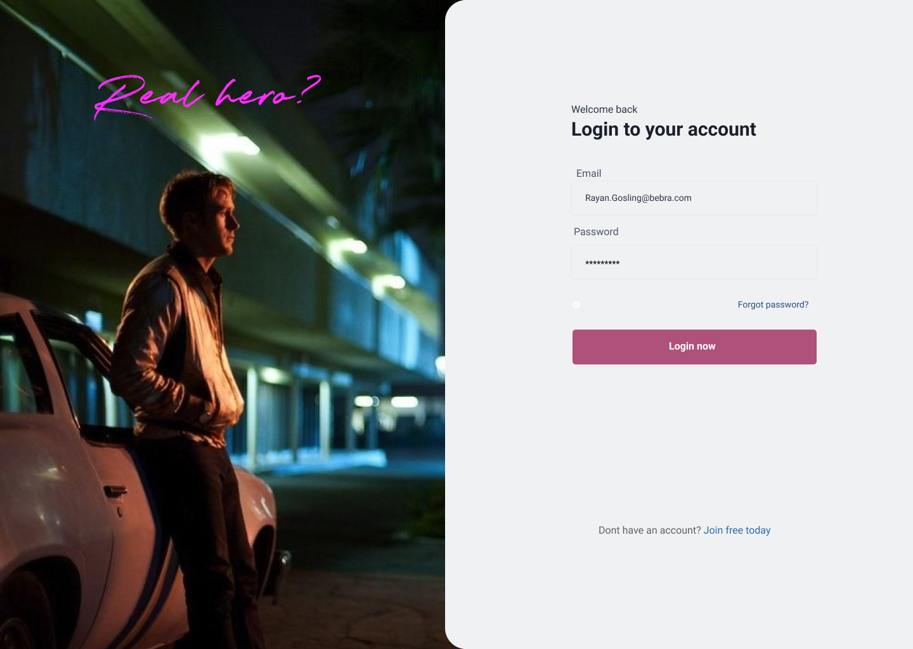
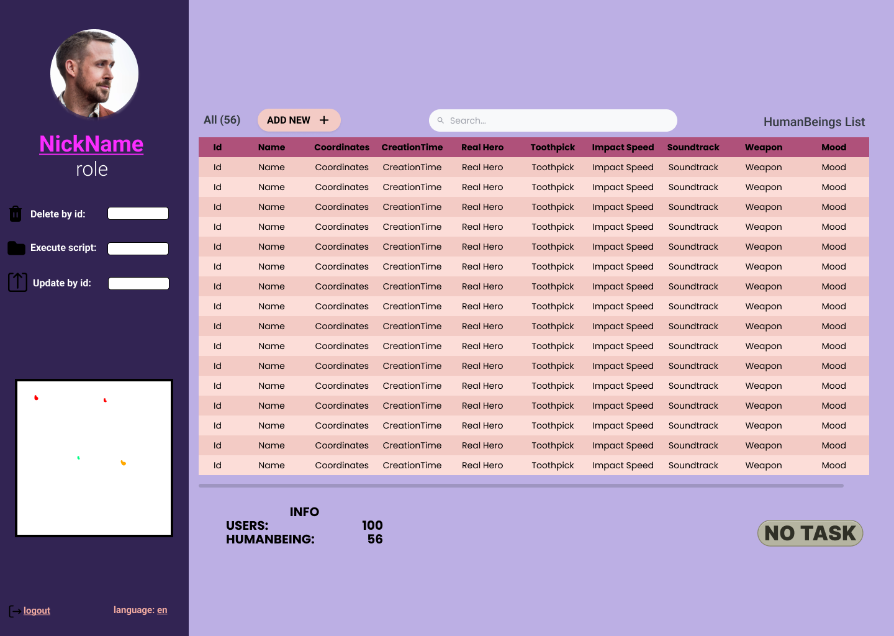
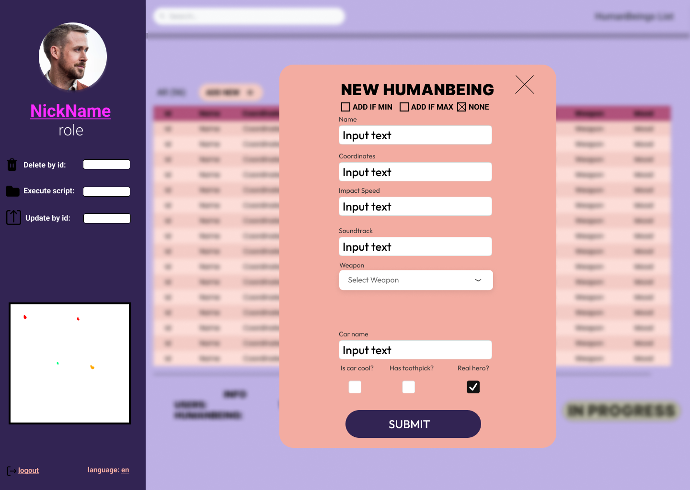
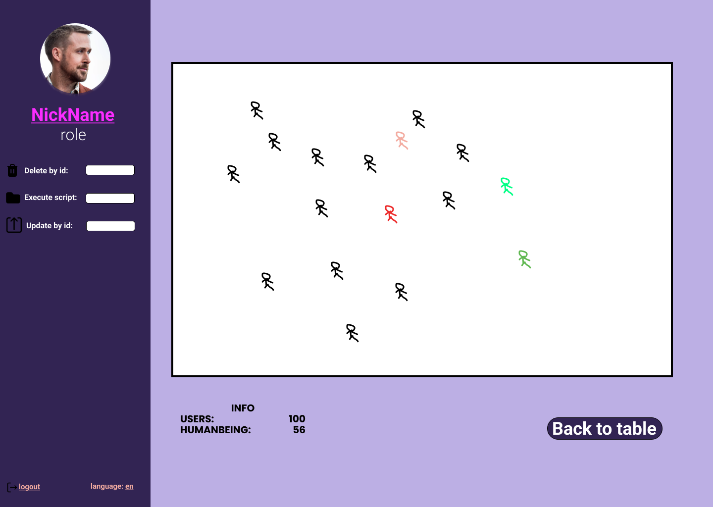

  

<em>Инфохимия</em>

<strong>Лабораторная работа №5  
По дисциплине : «Программирование» 

Преподаватель: <strong>Райла Мартин</strong> 
Выполнил: <strong>Дьяконов Александр</strong> 
Группа: <strong>O3143</strong>

# Лабораторная работа #5 вариант - 125595

## 1. Задача
Реализовать консольное приложение, которое реализует управление коллекцией объектов в интерактивном режиме. В коллекции необходимо хранить объекты класса HumanBeing.
## 2. Ограничения
Программа должна удовлетворять следующим требованиям:

1. Класс, коллекцией экземпляров которого управляет программа, должен реализовывать сортировку по умолчанию.
2. Все требования к полям класса (указанные в виде комментариев) должны быть выполнены.
3. Для хранения необходимо использовать коллекцию типа java.util.LinkedHashSet
4. При запуске приложения коллекция должна автоматически заполняться значениями из файла.
5. Имя файла должно передаваться программе с помощью: аргумент командной строки.
6. Данные должны храниться в файле в формате csv
7. Чтение данных из файла необходимо реализовать с помощью класса java.io.FileReader
8. Запись данных в файл необходимо реализовать с помощью класса java.io.FileWriter
9. Все классы в программе должны быть задокументированы в формате javadoc.
10. Программа должна корректно работать с неправильными данными (ошибки пользовательского ввода, отсутсвие прав доступа к файлу и т.п.).

## 3. Команды
    help : вывести справку по доступным командам
    info : вывести в стандартный поток вывода информацию о коллекции (тип, дата инициализации, количество элементов и т.д.)
    show : вывести в стандартный поток вывода все элементы коллекции в строковом представлении
    add {element} : добавить новый элемент в коллекцию
    update id {element} : обновить значение элемента коллекции, id которого равен заданному
    remove_by_id id : удалить элемент из коллекции по его id
    clear : очистить коллекцию
    save : сохранить коллекцию в файл
    execute_script file_name : считать и исполнить скрипт из указанного файла. В скрипте содержатся команды в таком же виде, в котором их вводит пользователь в интерактивном режиме.
    exit : завершить программу (без сохранения в файл)
    add_if_max {element} : добавить новый элемент в коллекцию, если его значение превышает значение наибольшего элемента этой коллекции
    add_if_min {element} : добавить новый элемент в коллекцию, если его значение меньше, чем у наименьшего элемента этой коллекции
    history : вывести последние 15 команд (без их аргументов)
    max_by_impact_speed : вывести любой объект из коллекции, значение поля impactSpeed которого является максимальным
    count_by_mood mood : вывести количество элементов, значение поля mood которых равно заданному
    print_ascending : вывести элементы коллекции в порядке возрастания

# Лабораторная работа #7 вариант - 5219568

## Задача

Усовершенствовать разработанное CRUD приложение, следующим образом:

1. Организовать хранение коллекции в реляционной СУБД (PostgresQL). Убрать хранение коллекции в файле.
2. Для генерации поля id использовать средства базы данных (sequence).
3. Обновлять состояние коллекции в памяти только при успешном добавлении объекта в БД
4. Все команды получения данных должны работать с коллекцией в памяти, а не в БД
5. Организовать возможность регистрации и авторизации пользователей. У пользователя есть возможность указать пароль.
6. Пароли при хранении хэшировать алгоритмом SHA-256
7. Запретить выполнение команд не авторизованным пользователям.
8. При хранении объектов сохранять информацию о пользователе, который создал этот объект.
9. Пользователи должны иметь возможность просмотра всех объектов коллекции, но модифицировать могут только принадлежащие
   им.
10. Для идентификации пользователя отправлять логин и пароль с каждым запросом.

Необходимо реализовать многопоточную обработку запросов:

1. Для многопоточного чтения запросов использовать Cached thread pool
2. Для многопотчной обработки полученного запроса использовать Cached thread pool
3. Для многопоточной отправки ответа использовать Cached thread pool
4. Для синхронизации доступа к коллекции использовать java.util.Collections.synchronizedXXX

## Ограничения

1. Использовать реляционную СУБД PostgreSQL на Helois

# Лабораторна работа #8 вариант - 548649

## Задача

Заменить консольный клиент на клиент с графическим интерфейсом пользователя(GUI).

Условия:

1. Интерфейс должен быть реализован с помощью библиотеки JavaFX
2. Графический интерфейс клиентской части должен поддерживать русский, белорусский, албанский и испанский (Гватемала)
   языки / локали. Должно обеспечиваться корректное отображение чисел, даты и времени в соответстии с локалью.
   Переключение языков должно происходить без перезапуска приложения. Локализованные ресурсы должны храниться в файле
   свойств.

В функционал клиента должно входить:

* Окно с авторизацией/регистрацией.
* Отображение текущего пользователя.
* Таблица, отображающая все объекты из коллекции
* Каждое поле объекта - отдельная колонка таблицы.
* Строки таблицы можно фильтровать/сортировать по значениям любой из колонок. Сортировку и фильтрацию значений столбцов
  реализовать с помощью Streams API.
* Поддержка всех команд из предыдущих лабораторных работ.
* Область, визуализирующую объекты коллекции
* Объекты должны быть нарисованы с помощью графических примитивов с использованием Graphics, Canvas или аналогичных
  средств графической библиотеки.
* При визуализации использовать данные о координатах и размерах объекта.
* Объекты от разных пользователей должны быть нарисованы разными цветами.
* При нажатии на объект должна выводиться информация об этом объекте.
* При добавлении/удалении/изменении объекта, он должен автоматически появиться/исчезнуть/измениться на области как
  владельца, так и всех других клиентов.
* При отрисовке объекта должна воспроизводиться согласованная с преподавателем анимация.
* Возможность редактирования отдельных полей любого из объектов (принадлежащего пользователю). Переход к редактированию
  объекта возможен из таблицы с общим списком объектов и из области с визуализацией объекта.
* Возможность удаления выбранного объекта (даже если команды remove ранее не было).

Перед непосредственной разработкой приложения необходимо согласовать прототип интерфейса с преподавателем. Прототип
интерфейса должен быть создан с помощью средства для построения прототипов интерфейсов(mockplus, draw.io, etc.)

## Согласованный интерфейс

  
  
  
  

